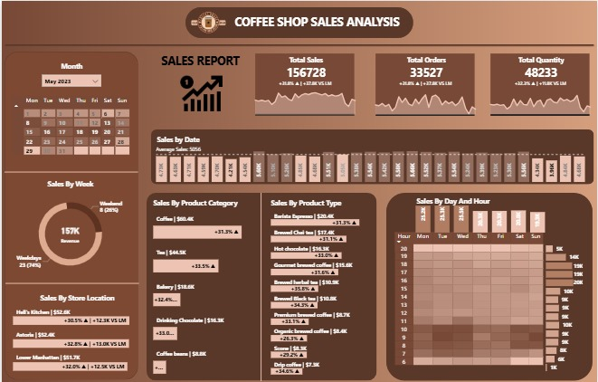

# ☕ Coffee Shop Sales Analysis – Power BI Dashboard  

## 📌 Project Overview  
This project presents a **Power BI dashboard** built to analyze and visualize sales data from a coffee shop chain for **May 2023**. The dashboard provides key insights into revenue, order trends, product performance, store-wise sales, and customer purchasing behavior.  

The aim of the project is to **support data-driven decision-making** by identifying top-performing products, peak business hours, and store-level performance to improve **sales forecasting, inventory planning, and customer retention strategies**.  

---

## 🚀 Features  
- 📊 **Key Performance Indicators (KPIs):**  
  - Total Sales: **156,728**  
  - Total Orders: **33,527**  
  - Total Quantity Sold: **48,233**  

- 📅 **Time-Based Analysis:**  
  - Sales by week, weekdays vs weekends  
  - Daily trends and average revenue insights  

- 🛒 **Product Insights:**  
  - Sales by category (Coffee, Tea, Bakery, Chocolate, Beans)  
  - Sales by product type (Espresso, Chai, Hot Chocolate, etc.)  

- 🏬 **Store Performance:**  
  - Comparison across Hell’s Kitchen, Astoria, and Lower Manhattan stores  
  - Revenue contributions & month-over-month growth  

- ⏰ **Customer Behavior:**  
  - Sales by day and hour heatmap to identify **peak hours**  

---

## 🛠️ Tools & Technologies  
- **Power BI** – Dashboard creation & data visualization  
- **Excel/CSV** – Data source  
- **Data Cleaning & Transformation** – Power Query  

---

## 📊 Dataset Information  
The dataset used for this analysis contains two sheets:  

### 🔹 Sheet 1 – Date Information  
| Column | Description |  
|--------|-------------|  
| Date | Calendar date |  
| Month | Month name (e.g., May) |  
| Month No | Numeric month (e.g., 5 for May) |  
| Mth Year | Month-Year format |  
| Day Name | Day of the week (e.g., Monday) |  
| Week No | Week number in the year |  
| Day Num | Numeric day of the month |  
| Week Day Num | Numeric weekday representation |  
| Weekdays And Weekend | Classification as “Weekday” or “Weekend” |  

### 🔹 Sheet 2 – Transactions Data  
| Column | Description |  
|--------|-------------|  
| transaction_id | Unique ID for each transaction |  
| transaction_date | Date of transaction |  
| transaction_time | Time of transaction |  
| transaction_qty | Quantity of items sold |  
| store_id | Unique store identifier |  
| store_location | Store location (Hell’s Kitchen, Astoria, etc.) |  
| product_id | Unique product identifier |  
| unit_price | Price per unit |  
| product_category | High-level product group (Coffee, Tea, Bakery, etc.) |  
| product_type | Specific product type (Espresso, Chai, etc.) |  
| product_detail | Detailed product description |  
| Sales | Total sales amount for the transaction |  
| Hour | Extracted hour of transaction |  

---

## 📈 Key Insights  
- **Coffee** is the top revenue generator contributing **$59.6K (+37.5%)**.  
- **Weekends drive higher revenue (157K)** compared to weekdays.  
- Peak sales occur during **morning & evening hours**.  
- Store-wise analysis shows **Hell’s Kitchen** as the leading contributor.  

---

## 📂 Repository Structure  
│-- 📄 README.md

│-- 📊 CoffeeSales-Dashboard.pbix # Power BI dashboard file

│-- 📑 Dataset.xlsx # Dataset (if shareable)

│-- 📷 Dashboard_Screenshot.png # Dashboard preview

---

## ⚡ How to Use  
1. **Clone or Download** this repository.  
2. Open the `Coffee_Shop_Sales.pbix` file in **Power BI Desktop**.  
3. If dataset is available (`Sales_Data.xlsx`):  
   - Place it in the same folder as the `.pbix` file.  
   - Open Power BI → Click **Refresh** to load the latest data.  
4. Interact with filters/slicers in the dashboard to explore:  
   - Sales by date, week, and time.  
   - Store-wise and product-wise performance.  
   - Customer purchasing patterns (peak hours, weekends vs weekdays).  
5. Optionally, publish the dashboard to **Power BI Service** to share online.  

---

## 📷 Dashboard Preview  
  

---

## 🎯 Conclusion  
The Coffee Shop Sales Analysis dashboard demonstrates how **Power BI can transform raw sales data into actionable insights**. The findings can help managers improve marketing strategies, optimize inventory, and enhance customer experience.  

